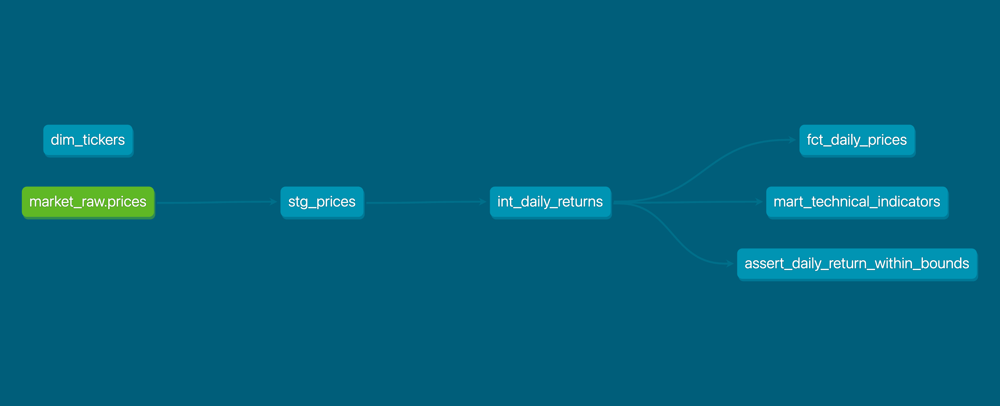

# Market Analytics Pipeline (dbt + BigQuery)

An analytics-engineering pipeline that ingests daily equity market data and
transforms it into a layered dbt model (staging -> intermediate -> marts) with a
dimensional model, a fact table, data-quality tests, and docs.

## Stack
dbt Core (dbt-bigquery) · BigQuery · Python (yfinance) · SQL

## Architecture
\`\`\`
yfinance ─(Python)─> BigQuery raw (market_raw.prices)
                           |
                      stg_prices            (staging: clean / cast / rename)
                           |
                   int_daily_returns        (intermediate: LAG, daily return)
                           |
          +----------------+---------------------+
   dim_tickers      fct_daily_prices     mart_technical_indicators
  (dimension)        (fact table)        (MA20/50, volatility, RSI14)
\`\`\`

## Setup (one-time)
1. Create a GCP project; open the BigQuery sandbox (free).
2. Create two datasets in the **same location** (e.g. US):
   \`market_raw\` (raw) and \`market_analytics\` (dbt output).
   \`bq --location=US mk --dataset PROJECT_ID:market_raw\`
3. \`pip install -r requirements.txt\`
4. \`gcloud auth application-default login\`
5. Copy \`profiles.example.yml\` to \`~/.dbt/profiles.yml\`, set your project id.
6. Edit the \`YOUR_GCP_PROJECT_ID\` placeholders in
   \`ingest/load_prices.py\` and \`models/staging/_staging.yml\`.
7. \`dbt debug\`  -> should be all green.

## Run
\`\`\`bash
python ingest/load_prices.py     # load raw prices into BigQuery
dbt run                          # build all models
dbt test                         # run schema + custom tests
dbt docs generate && dbt docs serve   # browse the lineage graph
\`\`\`

## Design notes (interview talking points)
- **Layering** — staging is 1:1 with the source (views, cheap); marts are
  materialized as tables for query performance.
- **Tests** — built-in (\`not_null\`, \`unique\`, \`relationships\`) plus a custom
  *singular* test flagging abnormal daily returns (a data-quality guardrail).
- **Macro** — \`pct_change()\` keeps the return calculation DRY.
- **Why BigQuery** — columnar storage suits analytical scans, unlike a
  row-store like PostgreSQL used for OLTP.

### Note on incremental materialization
\`fct_daily_prices\` ships as a **full-refresh table** in this repo because the
BigQuery **sandbox** (free tier) disallows DML, which dbt's incremental
strategies (\`merge\` / \`insert_overwrite\`) rely on. In a billed environment the
same model runs as a true incremental — processing only new trading days
instead of rebuilding history:

\`\`\`sql
{{ config(materialized='incremental', unique_key='price_id',
          incremental_strategy='merge') }}
...

where trade_date > (select max(trade_date) from {{ this }})

\`\`\`sql
